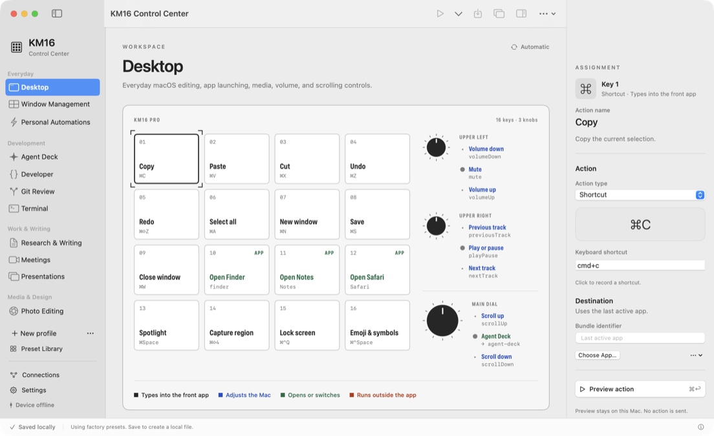
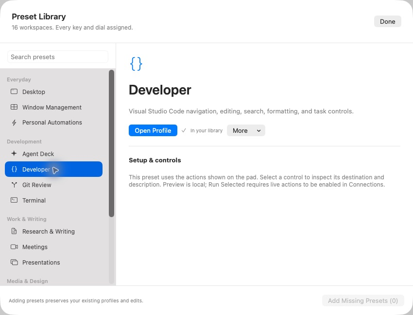
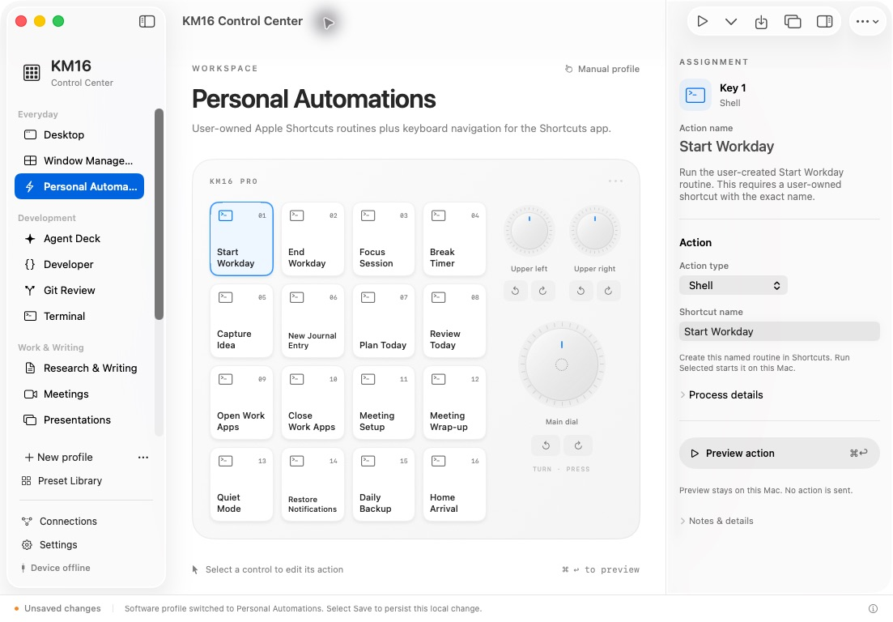
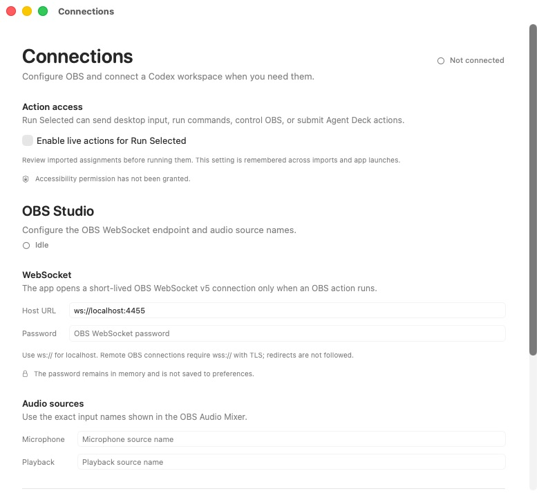

# KM16 Control Center

A macOS profile editor and action launcher for the MMD KM16 Pro macro pad.
Assign shortcuts, text, commands, and app actions to its 16 keys and three knobs.

The app works without a pad connected. Profiles stay on the Mac; live pad
input, device configuration, and firmware flashing are not implemented. This
repository also contains the hardware research and a portable C firmware core.

Try the [browser demo](https://sebastianspicker.github.io/km16-control-center/)
with the same factory presets. All actions are simulated. See the
[demo guide](site/README.md) to run it locally or host your own copy.

## Get started

Requires macOS 14 or newer, a Swift 6 toolchain, and Python 3.10 or newer. From the
repository root:

```sh
bash script/build_and_run.sh
```

The script builds and opens `build/apps/KM16ControlCenter.app`. Add `--build-only`
to build without launching. Close the app before rebuilding. This is an unsigned,
unnotarized development build.

Choose a profile, select a key or knob, then use **Preview action** or
**Command-Return** to simulate its assignment. To execute an action, enable live
actions in **Connections** and use **Run Selected**. Desktop input requires macOS
Accessibility permission. Review imported assignments first: profiles can contain
commands, text, and agent prompts.

See the [app guide](apps/KM16ControlCenter/README.md) for storage, import/export,
recovery, and optional OBS and Codex setup.

## Screenshot tour

These screenshots show the running app with factory profiles. Live actions are
disabled and optional services are not connected.

### Profile editor

Switch profiles in the sidebar and select any key, knob turn, or knob press to
inspect its action. The Desktop preset covers everyday editing, app launching,
media, and scrolling.



### Preset library

The library includes 16 presets and 400 assignments for development, writing,
meetings, creative work, and streaming. Adding missing presets preserves existing
edits. App-specific presets may need setup; the
[preset catalog](presets/README.md) lists the requirements.



### Action inspector

Edit shortcuts, text, app destinations, and commands in the assignment inspector.
Personal Automations calls your own Apple Shortcuts by name; create those routines
in Shortcuts before running them. Preview shows what would run without starting it.



### Connections

Connections holds the live-action setting and optional integration setup. OBS uses
WebSocket v5, with its password kept in memory. Agent Deck connects to an installed
Codex CLI and a workspace you choose. Neither service is needed to edit profiles.



## Documentation and development

| Guide | What you'll find |
| --- | --- |
| [App guide](apps/KM16ControlCenter/README.md) | Profiles, desktop actions, OBS, Agent Deck, and recovery |
| [Preset catalog](presets/README.md) | Assignments and setup instructions for the included apps |
| [Browser demo](site/README.md) | Interactive mockup, local preview, and GitHub Pages setup |
| [Contributing](CONTRIBUTING.md) | Development requirements and verification commands |
| [Architecture](docs/development/COMPANION-ARCHITECTURE.md) | Swift package boundaries and integration behavior |
| [Development status](docs/development/IMPLEMENTATION-LEDGER.md) | Implemented features and remaining work |
| [Releasing](docs/RELEASING.md) | Source releases and Mac app distribution requirements |

The public source checks run without a pad, OBS, Codex, or private research files:

```sh
bash scripts/verify-source.sh
```

The full suite also requires full Xcode, Node.js, and CMake; see
[Contributing](CONTRIBUTING.md) for versions and focused checks.

## Hardware research

The research documents the examined KM16 Pro board and stock behavior. Findings
are tied to the recorded hardware and firmware revisions. The
[portable C core](firmware/custom/README.md) has host tests and a demo; it is not a
flashable firmware image.

| Guide | Contents |
| --- | --- |
| [Board analysis](docs/analysis/LIVE-FIRMWARE-ANALYSIS.md) | Application readback, hardware findings, and acquisition limits |
| [Offline findings](docs/analysis/OFFLINE-FINDINGS.md) | Settings, protocol behavior, and recovered hardware contract |
| [Key and knob mapping](docs/analysis/KNOB-MAPPING.md) | Observed stock-layer assignments |
| [Reference-image analysis](docs/analysis/FIRMWARE-ANALYSIS.md) | A separate vendor image with unproven compatibility |
| [Mac research tools](docs/workflows/mac-tools.md) | Device snapshots, HID capture, WebHID logging, and offline analysis |

Vendor firmware, raw captures, and third-party reference files are excluded from
the repository. Reports retain hashes and artifact names for provenance. Public
tests use synthetic fixtures; reproducing the research requires matching original
inputs.

## License

Original code and documentation are [MIT licensed](LICENSE). The license does not
grant redistribution rights for vendor firmware or third-party material.
