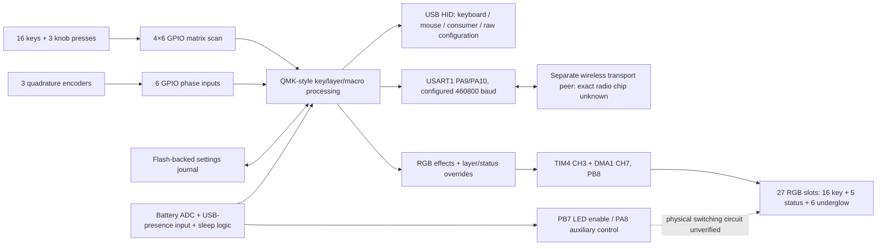

# KM16 Pro firmware and hardware architecture

This 2026-09-12 report uses the connected board's readback, USB descriptors,
isolated input captures, and supplied VIA definition. The downloaded V0101 image
is only a comparison reference. See the
[offline findings](OFFLINE-FINDINGS.md) for recovered drivers, console
identification, flash geometry, debug configuration, exact encoder behavior, wake
sources, and battery boundaries.

## Acquisition and confidence

The readback at
`evidence/backups/dfu-backup-20260912T103449Z/km16pro-live-alt2-0x08002000.bin`
contains 122,880 bytes, starting at the bootloader's advertised application address
`0x08002000`. Three independent reads are byte-identical:

```text
SHA-256 5ff18a34b99de0e6ebb657f9f79df8e35a8b8e21459997096c24209bc493262e
```

All three `dfu-util` runs ended with status 74 / `LIBUSB_ERROR_PIPE` after receiving
those bytes. The inferred captured range is `[0x08002000, 0x08020000)`. This is an
application-region readback, not a completed full-chip dump: the first 8 KiB,
including the bootloader, were not captured, and the end of the upload window does
not measure the chip's total flash capacity. No restoration was attempted.

An embedded 16-byte DFU suffix at readback offset `0xDDB0` contains CRC `40BE7625`,
which exactly verifies the application bytes.
All four HID report descriptors in this image exactly match the board's normal-mode
registry snapshot. Its device descriptor says `28e9:3145`, `bcdDevice=0x0104`.

The local acquisition record at
`evidence/backups/dfu-backup-20260912T103449Z/README.md` preserves commands,
descriptors, stdout/stderr, return codes, repeat comparisons, and hashes. The local
bootloader capability analysis at
`evidence/backups/dfu-backup-20260912T103449Z/hardware-capabilities.md` includes the
raw USB/DFU descriptors: `1eaf:0003`, SmartBoot, DFU 1.1,
2048-byte transfers, and alternate interfaces advertising application offsets
`0x08002000` and `0x08005000`. These are exposed bootloader capabilities, not
proof of a particular MCU or an invitation to write either region.
No firmware download, erase, unprotect, detach, reset, or configuration write was
performed.

Vendor binaries, readbacks, captures, decompiler exports, and generated analysis
artifacts are excluded from releases. Their paths remain as provenance identifiers.

## System overview



The application has QMK-style key processing and VIA configuration on top of
ChibiOS-style scheduling, queues, GPIO, USB, timer and flash drivers. Recognizable
code and data establish these architectural families, not a precise upstream
commit or a reproducible original source tree.

USB is implemented on the main controller. Wireless traffic is forwarded over a
UART rather than through a Bluetooth stack identified inside this application.
The radio peer's exact part number and firmware remain unknown.

## MCU identity and clocks

The exact MCU is unknown. The strongest supported description is an ARM Cortex-M
controller using an STM32F1-compatible peripheral map, with
STM32F103-class software compatibility. A genuine STM32F103 and compatible silicon
cannot be distinguished from these constants, USB IDs, or the bootloader name.
The package marking, silicon identification registers, and SRAM capacity have not
been read. The filename token `IT32CTB0` is not a verified chip part number.

The register mapping was checked against the STMicroelectronics header at
`reference/stm32f103xb.h`; `reference/sources.json` records its provenance. The
header is a map reference, not evidence that the installed chip is that exact ST
device.

| Evidence from the acquired application | Meaning and limit |
| --- | --- |
| Thumb-2, BASEPRI, MSP/PSP and VTOR use | Cortex-M3/M4-class instruction/system model; no exact core ID read |
| GPIOA `40010800`, GPIOB `40010C00`, GPIOC `40011000` | F1-compatible GPIO register map |
| RCC `40021000`, FLASH `40022000`, USB `40005C00` | F1-compatible clock/flash/USB peripherals |
| USART1 `40013800`, ADC1 `40012400`, TIM4 `40000800` | Peripherals actually used by the application |
| Flash-size access at `1FFFF7E0` | Code derives settings backing from chip-reported flash size; the register value itself is outside the backup |
| Bootloader marker check at `080000F0` against `DEADBEEF` | Application expects a matching bootloader marker; that region was not dumped |

Clock setup at `0x0800D720` enables HSE and PLL, with PLL ×9 and final RCC CFGR
`0x001D6402`. Under the verified F1 register interpretation: AHB ÷1, APB1 ÷2,
APB2 ÷2, PLL fed from undivided HSE, and USB clock from PLL ÷1.5. Serial/PWM
constants explicitly use 36 MHz. Together these support a configured 72 MHz
system clock from an 8 MHz HSE, APB clocks 36 MHz and USB 48 MHz. These are
software-derived operating assumptions, not oscillator measurements. Battery ADC
initialization later changes the ADC divider to ÷8, giving 4.5 MHz under that setup.

The RTC setup selects the internal low-speed oscillator and uses a 39,999 prescaler
value, consistent with a nominal 40 kHz LSI. PC14/PC15 are used for encoder inputs,
so this application does not use those pins for an external 32.768 kHz LSE crystal.

## Flash and RAM layout

| Address range, end exclusive | Contents established by this analysis |
| --- | --- |
| `08000000–08002000` | Bootloader region, outside the acquired window |
| `08002000–0800FDB0` | Application code, constants and initialized data: 56,752 bytes |
| `0800FDB0–0800FDC0` | Embedded DFU suffix, present in actual flash and CRC-valid |
| `0800FDC0–0801E000` | Read back as erased `FF` |
| `0801E000–0801F000` | Settings base snapshot area; erased `FF` in this acquisition |
| `0801F000–0801F008` | Settings snapshot integrity field; erased in this acquisition |
| `0801F008–0801F476` | Populated settings journal: 476 decoded records |
| `0801F476–08020000` | Erased journal terminator and remainder |

The application starts with an 88-word vector area. Its reset vector is
`0x08002239`, initial MSP `0x20000400`, and startup sets PSP `0x20000C00` and
VTOR `0x08002000`. Startup copies 596 initialized bytes from `0x0800FB5C` into
`0x20000C00–0x20000E54`, then clears BSS `0x20000E58–0x20002C84`.
These allocated addresses establish usage, not the total RAM capacity. The actual
RAM contents at acquisition time were not captured.

Bootloader-triggering application code writes marker `0x424D` to an F1-compatible
backup register at `0x40006C28` and calls the system reset routine `0x0800B0FC`.
This is a recovered application path, not a command sent to the device or a fully
verified physical button-entry recipe.

## Key matrix and encoders

GPIO names below are decoded from live pointer tables using the F1-compatible map.
They describe the firmware's wiring expectations; no PCB continuity test was done.

| Role | Pins in firmware index order |
| --- | --- |
| Matrix rows 0–3 | PA0, PA1, PA2, PA3 |
| Matrix columns 0–5 | PB0, PC13, PB2, PB10, PB11, PB12 |
| Encoder 0 phases | PB5, PB4 |
| Encoder 1 phases | PA6, PA7 |
| Encoder 2 phases | PC14, PC15 |

The scan temporarily drives one column low and reads pulled-up rows. A low row
means pressed; the column then returns to input pull-up. The matrix can address
24 intersections, while the supplied physical definition exposes 19 switches:
16 keys and three knob presses. It does not establish whether diodes are fitted
or their polarity.

The logical press coordinates are upper-left `(0,4)`, upper-right `(0,5)`, lower
`(2,5)`, corresponding to row/column pin pairs PA0/PB11, PA0/PB12, PA2/PB12.
The remaining five matrix intersections are unused in the definition.

Debounce accepts a stable matrix sample after a `>5` millisecond time difference,
approximately a six-tick gate with integer-millisecond quantization. That is a
code-derived threshold; total input latency was not measured.

All three encoders use the same polled Gray/quadrature accumulator with a 16-entry
`-1/0/+1` transition table. No distinct lower-knob algorithm, mechanical detent
count, acceleration setting, or separate electrical resolution was established.
The large knob on the studied unit is physically smooth. GPIO state transitions
and mechanical clicks are not interchangeable counts.

Exact code and table addresses and raw pin words are recorded in
`evidence/analysis/live-20260912/matrix-encoder-findings.md` and
`evidence/analysis/live-20260912/hardware-inputs.json`.

## LEDs: groups, positions and transport

The recovered board map is retained locally at
`evidence/analysis/live-20260912/board-map.svg`.

The application outputs one 27-slot RGB chain. A generic QMK flag array calls
slots 16–26 “underglow”, but the custom code assigns different roles within them:

| LED indices | Count | Recovered role |
| --- | ---: | --- |
| `0–15` | 16 | Per-key RGB, exact matrix mapping and coordinates recovered |
| `16–20` | 5 | Layer/status indicator group; set together by default-layer and host-status logic |
| `21–26` | 6 | Underglow group; copied from the separate rgblight buffer, with power/state overrides |

Key LED indices in physical key order:

| Row | Left | Second | Third | Right |
| --- | ---: | ---: | ---: | ---: |
| Top | 12 | 13 | 14 | 15 |
| Second | 11 | 10 | 9 | 8 |
| Third | 4 | 5 | 6 | 7 |
| Bottom | 3 | 2 | 1 | 0 |

The key coordinate columns are `x=0,75,149,224`; rows are `y=0,21,42,64`.
These are normalized animation coordinates, not millimetres. The eleven non-key
LEDs all have `(0,0)` placeholders, so their individual physical positions and
chain order around the case cannot be reconstructed from coordinates alone.
Knob press cells have matrix-to-LED value `FF`, meaning no mapped key LED there.

The live initialized-data structure has matrix map at RAM `0x20000C35`, 27 coordinate
pairs at `0x20000C4D`, and 27 flag bytes at `0x20000C83`. Corresponding flash
initializers are `0x0800FB91`, `0x0800FBA9`, and `0x0800FBDF`. This table is why
the input matrix size must not be used to guess LED count.

Layer/status setter `0x08004568` writes all five LEDs 16–20. Its caller
`0x08004744` selects different colours for default-layer masks 1,2,4,8,16,32.
Host/pairing status can temporarily override the layer colour. The exact triples
and state paths are recorded in
`evidence/analysis/live-20260912/led-findings.md`.

| Default layer | RGB triple, before any later output transformation |
| --- | --- |
| 0 | `(100,0,0)` |
| 1 | `(0,100,0)` |
| 2 | `(100,0,100)` |
| 3 | `(100,25,0)` |
| 4 | `(100,10,50)` |
| 5 | `(0,50,100)` |

The output backend uses PB8 / TIM4 channel 3 / DMA1 channel 7 under the F1 map.
The driver sets prescaler `PSC=1` from its 72 MHz timer clock and reload
`ARR=44`, giving a 36 MHz counter and 45-tick period: 800 kbit/s.
Each RGB bit becomes a timer compare sample: 9 ticks for zero and 30 for one,
giving high times of 250 ns and approximately 833 ns. Twenty-four samples per
LED ×27 =648 samples, followed by 170 zero samples =818 DMA entries. The reset
tail is approximately 212.5 μs and one complete repeated buffer about 1.0225 ms.
DMA uses circular output; this buffer rate is not the animation-update rate.

The stored colour channels are serialized in the `[1],[0],[2]` permutation,
consistent with GRB output. The signalling strongly supports a WS2812/SK6812-like
addressable RGB chain; it does not identify the exact LED package or IC.
The byte buffer contains compare values, not ordinary SPI/UART pixel bytes.

PB7 is a firmware LED-enable control: initialization configures it output-low;
active-state code raises it and sets the LED-enabled state; sleep paths lower it
and clear that state. The lighting overrides read that same state and blank the
underglow, including a one-frame blank after re-enable. This links the GPIO to
LED power/state handling. The physical transistor/load switch, supply voltage,
and rail connectivity remain unverified.

## Battery, supply detection and sleep

ADC1 channel 9 is configured on PB1. The firmware takes ten samples, sorts
them, discards the minimum and maximum, and averages the middle eight. It repeats
that process for internal-reference channel 17, then calculates:

```text
battery_value = floor(trimmed_ADC9 * 1764 / trimmed_ADC17)
```

The following piecewise battery-percent function uses values approximately
3200–4150, consistent with an intended millivolt-scale Li-ion estimate. It does
not expose resistor values or establish actual calibration. Battery estimation
runs initially and then after more than 10,000 firmware milliseconds, with
additional smoothing of the displayed percentage. The macro pad can display
battery state using its key LEDs and send a battery byte over the wireless link.

PB9 is read as a power/USB-presence input by `0x08003474`. The code uses
that input together with charging/battery state, but the charger IC, its status
net, battery capacity, and electrical polarity beyond the GPIO read are not
established. An additional PA8 output is raised during initialization and
changed around sleep/wake sequences; its exact external load remains unresolved.

The sleep paths disable the ADC, quiet USB, change GPIO modes, configure wake
events, set Cortex deep-sleep state, and execute WFI. Wake restores the clock,
matrix and ADC setup. There are host/state-dependent inactivity thresholds;
no single universal sleep interval is inferred from those branches.

## USB configuration and protocol

The acquired application contains a 116-byte USB configuration descriptor at
`0x0800F6DC`, with four interfaces. It declares bus-powered operation, remote-wake
support, and a maximum USB request of 500 mA. The bootloader separately
declares 100 mA. Neither value is a measured current draw or an LED power budget.

| Interface | Endpoints | Report use |
| --- | --- | --- |
| 0 | `81 IN`, max 8 bytes | Boot keyboard |
| 1 | `82 IN` and `03 OUT`, max 32 bytes | VIA/raw HID, `FF60:0061` |
| 2 | `84 IN`, max 32 bytes | Mouse, system, Consumer/media and NKRO report IDs |
| 3 | `85 IN`, max 32 bytes | QMK-style debug console `FF31:0074`; confirmed by the offline findings |

All listed interrupt endpoint intervals are 1 ms. This is descriptor scheduling
information, not measured end-to-end latency. USB uses the F1-compatible peripheral;
initialization temporarily drives PA12 / D+ low before restoring it, implementing
a software disconnect/reconnect sequence.

The live VIA dispatcher at `0x0800AA26` returns protocol version 12 and
supports six layers, per-key and per-encoder read/write, sixteen macro slots with
3690 bytes total storage, and two lighting channels. Raw receive/send buffers are
32 bytes, verified in both code and descriptors.

In the downloaded reference, `0x0A` interception forwarded a 66-byte UART frame. The live image's pre-dispatch hook at `0x0800A832`
returns zero. Live commands `0x0A` and `0x0B` reach the unhandled `FF` response
path. Consequently the reference vendor bridge is absent on the live VIA route.
No live configuration commands were sent to test these static interpretations.

## Wireless peer and internal protocol

The application switches between two five-entry HID callback tables: one for USB
and one for a UART-connected wireless peer. The table slots handle host keyboard
LED state, boot keyboard, NKRO-style keyboard, mouse, and system/consumer reports.
This lets the same key/layer engine serve both connection types. Logical slots
1–3 select Bluetooth hosts; slot 4 selects the mode labelled 2.4 GHz. The configured
Bluetooth names are `KM16pro BT5.3-1` through `-3`; the name alone does not establish
Bluetooth qualification or identify the radio silicon.

USART1 uses PA9 TX and PA10 RX, requested baud 460800, IRQ 37, and separate
128-byte transmit/receive queues. With the configured 36 MHz peripheral clock,
the baud divisor is 78. Identified frames use `55 | body_length | body`, without
a checksum or escaping in the recovered builders/parser:

| Frame bytes, hexadecimal | Recovered MCU-side role |
| --- | --- |
| `55 09 01` + 8 bytes | Boot keyboard report |
| `55 15` + 21 bytes | NKRO-style keyboard report |
| `55 06` + 6 bytes | Changed mouse report |
| `55 03` + 3 bytes | System/consumer report |
| `55 03 00 slot 01` | Select/configure slot; transmitted twice |
| `55 14 00 slot` + 18 bytes | Zero-padded device name; configuration sends twice |
| `55 02 09 battery` | Battery update |
| `55 02 00 00` | Emitted on wired/sleep transitions; peer-side meaning inferred |

The receive parser accepts `55 03 selector slot value`. Selector 0 controls the
connection-ready flag that gates wireless reports; selector 1 updates host keyboard
LED state; selector 2 on slot 4 handles `AA`/`BB` state values, with the set flag
feeding a sleep path. Configuration and wake code also emits runs of zero bytes
whose peer-side meaning remains unverified.

The local wireless protocol note
`evidence/analysis/live-20260912/wireless-findings.md` records callback addresses,
exact packet lengths, parser state, mode persistence,
and GPIO interactions. These are recovered MCU-side operations, not captured UART
traffic or verification of the radio's implementation. No separate radio firmware
has been identified or acquired.

## Saved settings

The logical EEPROM is 4096 bytes. Storage reads invert physical halfwords; an
erased physical base therefore starts as logical zero. The loader also clears its
base buffer on checksum failure. Replaying the live journal reconstructs the same
zero-based state without assuming that the erased base checksum was valid.

The decoder processes 476 records: 91 variable-byte records,
337 compact-byte records, and 48 boolean/zero-word records, then stops exactly
at the erased terminator at `0x0801F476`. Record boundaries and error cases have
focused tests, including the two-byte length of boolean records.

The reconstructed `evidence/analysis/live-20260912/logical-eeprom.bin` has SHA-256
`a11f6a9a82c2a68ffcf84a78e4b9efa60a81798f92ccd461af0d108c2aa1b4ea`.
Its metadata contains the `FEE6` validity value checked by the live firmware.

| Logical region | Size | Result |
| --- | ---: | --- |
| `000–02D` | 46 | Metadata; default-layer mask at byte 3 is 1, selecting layer 0 |
| `02E–14D` | 288 | Six 4×6 keymaps; all 144 keycodes match compiled defaults |
| `14E–195` | 72 | Six layers × three encoders × two direction slots |
| `196–FFF` | 3690 | Macro buffer; all zero in reconstructed state |

Stored dynamic keycodes are big-endian; factory ROM keycodes are little-endian.
Saved layer 0 matches the captured `1..0`, arrows, Enter, and Fn key arrangement.
Fn is `MO(5)`. Knob presses are local lighting toggle, Play/Pause, and a persistent
default-layer change to layer 1. Subsequent factory layers advance the lower press
through layers 2–5 and back to 0. The separate custom “Layer Toggle” key only toggles
default layers 0 and 1; it is not that six-layer progression.

All stored encoder slots on layers 1–5 are zero. Layer 0 contains:

| Encoder | Stored direction 1 | Stored direction 0 |
| --- | --- | --- |
| 0 | `004E` Page Down | `004B` Page Up |
| 1 | `00AB` Next Track | `00AC` Previous Track |
| 2 | `00AA` Volume Down | `00A9` Volume Up |

Encoder 2 is reversed relative to the compiled factory pair. The journal records
the original values and later changes at `0x0801F438` and `0x0801F43C`.
These are record order, not timestamps. The firmware maps the two decoder signs
uniformly into direction slots and does not call either sign physical clockwise.
The observed physical mapping in [KNOB-MAPPING.md](KNOB-MAPPING.md) is the primary
record. The stored lower-knob values are compatible with CW using direction
0 and CCW using direction 1. The readback and earlier captures were not simultaneous,
so a fresh controlled test would be needed to close that temporal distinction.

`evidence/analysis/live-20260912/settings.json` contains the complete tables and
per-record write history.

## Reproduce the analysis

```sh
python3 scripts/analysis/analyze-live-firmware.py
python3 scripts/analysis/decode-live-eeprom.py \
  evidence/backups/dfu-backup-20260912T103449Z/km16pro-live-alt2-0x08002000.bin \
  --output build/analysis/live/logical-eeprom.bin \
  --json build/analysis/live/settings.json
python3 -m unittest discover -s scripts/tests -p 'test_eeprom_decode.py' -v
```

The static scripts guard the exact acquired hash and never open a device.
Ghidra's saved project is `evidence/analysis/live-20260912/ghidra/KM16ProLive.gpr`.
The analysis identifies the raw sender, marks system reset as non-returning, and
reconstructs startup `.data` to recover callback tables. It exports 630 function
entries with C-like output and assembly. That is not original source code or a
proof that every function boundary/type is correct. The subsequent offline pass
recovers 29 more callback entries, for 659 total, in a separate project. `.data`
initialization in the analysis project reproduces reset-time values, not a captured
running RAM snapshot.

`evidence/analysis/live-20260912/verification.json` records 19 offline
integrity/consistency checks, five journal-decoder tests, six CLI validation cases,
and twelve descriptor checks. The local artifact hash manifest
`evidence/analysis/live-20260912/sha256.json` covers the final reports, analysis
data, exports, and scripts; mutable Ghidra project internals are excluded. The local
PNG board map at `evidence/analysis/live-20260912/board-map.png` was rendered and
visually inspected; the adjacent SVG retains scalable text.

## Remaining limits

Exact hardware identification requires evidence outside this application window:
chip markings or silicon ID, the radio module identity, the first 8 KiB,
power-circuit tracing, and physical positions of the eleven non-key LEDs. The
product branding does not establish an MCU, radio, charger, LED-package part number,
supply voltage, or battery capacity. The supplied reference was not flashed and
does not override the connected board's information.
